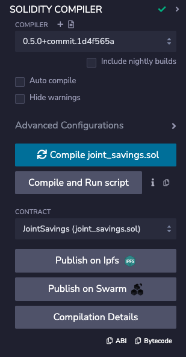
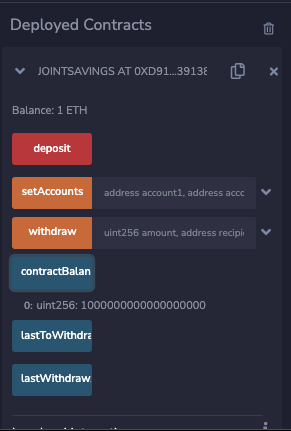
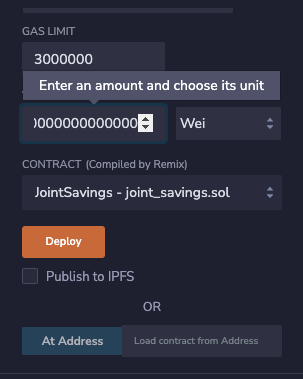
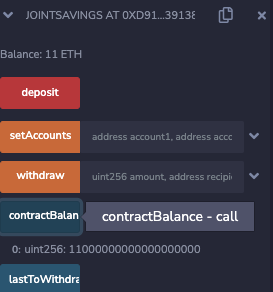
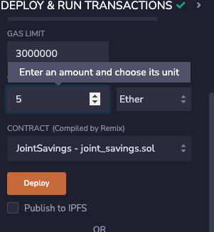
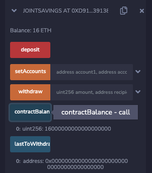
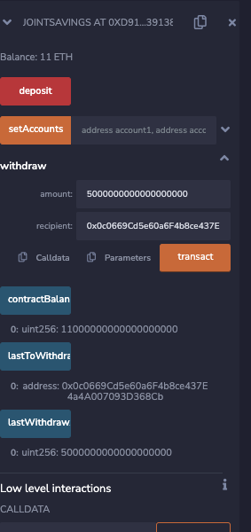
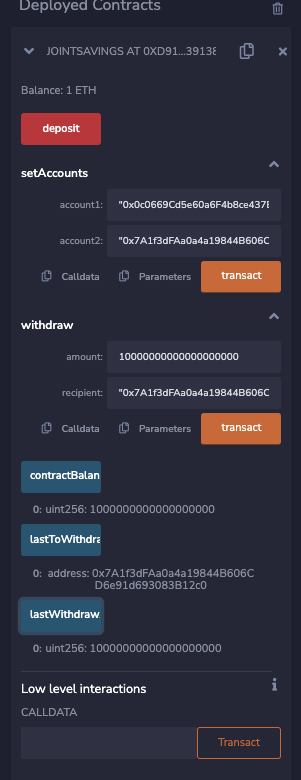

# Fintech Finder
This is a RemixIED notebook to automate the creation of joint savings accounts. It creates a Solidity smart contract that accepts two user addresses. These addresses will be able to control a joint savings account. The smart contract will use ether management functions to implement a financial institution’s requirements for providing the features of the joint savings account. The features consist of the ability to deposit and withdraw funds from the account in ETH.
---

## Technologies

This project leverages the pragma solidity version 0.5.0 using the following technologies:

* [RemixIDE](https://remix.ethereum.org/) - The Remix Project is a rich toolset which can be used for the entire journey of contract development by users of any knowledge level, and as a learning lab for teaching and experimenting with Ethereum.

* [solidity](https://soliditylang.org/) - Solidity is an object-oriented programming language for implementing smart contracts on various blockchain platforms, most notably, Ethereum.

* [vanity](https://vanity-eth.tk/) - Vanity-ETH is an open source tool using your web browser to generate Ethereum vanity addresses.

---

## Installation Guide

Before running the application first install the following dependencies. Note that if you are running on the cloud and not locally you will have to run all lines of code.

You will need to set up a Ganache accout and run the quick start. Follow the instructions on the [RemixIDE](hhttps://remix.ethereum.org/) to get started and uplodad your notebok. Make sure to use the correct pragma of solidity to run the code and compile correctaly. 

```
pragma solidity ^0.5.0

```


---

## Usage

Use RemixIDE
Vanity 

---

## Examples
```
function withdraw(uint amount, address payable recipient) public {
        require(recipient == accountOne || recipient == accountTwo, "You don't own this account!");

        require(amount <= contractBalance, "Insufficient funds!");

        if (lastToWithdraw != recipient) {
            lastToWithdraw = recipient;
        }

        recipient.transfer(amount);

        lastWithdrawAmount = amount;

        contractBalance = address(this).balance;
    }

```

---

## Below are examples of the contract running in RemixIED

This displays that the contract was compiled in RemixIED


### Deposits

#### The following screen shots are showing the contract was able to deposit 1 ETH as WEI, 10 ETH as WEI, and 5 ETH to the addresses provided. 

1 ETH added to account


Showing 10ETH as WEI and the Balance



Shows the 5 ETH and the total balance of 16ETH



### Withdrawals

#### The following screen shots show the withdrawal transactions and the addresses to which they went and the amount in WEI

Withdrew 5ETH into account 1. 


Withdrew 10ETH into account 2 and final balance of the contract.


## Conclusion
As you can see I was able to exciute deposits and withdrawals. The contract preforms as needed and the ending balance is 1ETH as dipicted in the last image. 


## Contributors

DU Starter Code
Terrence McCoy


---

## License

MIT
